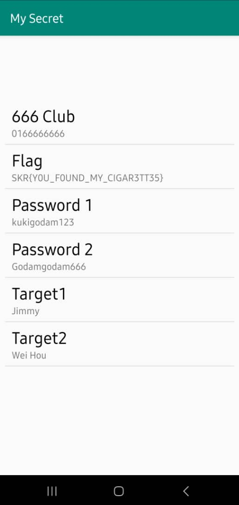

# What5Th3Pa55Cod3? 

After we used Kuki's birthday to unlock a phone in his place, we found a `mysecret.apk` in the phone, but it needs a passcode to view the secret.

Flag format: SKR{flag}

Note: Download the qrcode.png to scan and download using an Android device

**Difficulty:** Medium

# Solution

First, to begin, I downloaded `mysecret.apk` ([mysecret apk](mysecret.apk)) on my laptop and used the QR code to download `mysecret.apk`  on my phone.:

After this, to analyze the apk file, use whatever tool you are comfortable with. Personally, I am more familiar with JADX-GUI.

After snooping around for a while, I found the `com` folder. A weird fact, but a lot of times the main source code for applications is stored in a master folder 'com'. So from in there, starting off at the 'MainActivity' folder, which I assume must run first, I just followed the code.

I follow the code through which I obtain the passcode and the date of birth. You can find it yourself just by reading through the code.

And finally, I obtain the flag.

**Flag:** SKR{Y0U_F0UND_MY_CIGAR3TT35}

tADAAHHH!!!
